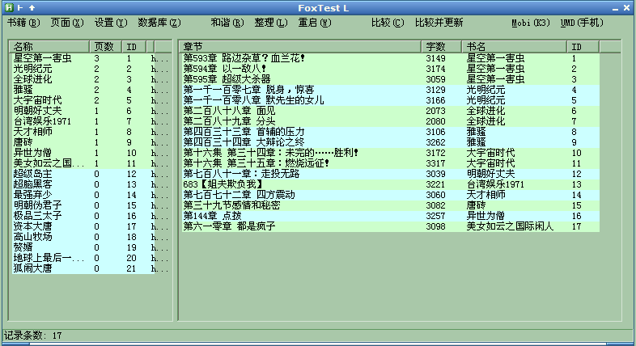

# FoxBook

**语言:** [Autohotkey](http://www.autohotkey.com)

**功能:** 狐狸的小说下载阅读及转换工具(下载常用小说站小说，制作为6寸PDF,mobi,epub,umd,chm,txt格式)

**作者:** 爱尔兰之狐(linpinger)

**邮箱:** <mailto:linpinger@gmail.com>

**缘起:** 用别人写的工具，总感觉不能随心所欲，于是自己写个下载管理工具，基本能用，基本满意

**原理:** 下载网页，分析网页，文本保存在数据库中，图片单独存放，转换为其他需要的格式

**亮点:** 使用自己写的imgsplit函数来切割图片为需要的大小，可以在手机及Kindle上看图片章节

**版本/分支说明:**

- master分支: 该分支是主更新分支，左右两侧均为listview控件
- tree  分支: 该分支是特性分支，左侧为treeview控件，右侧为listview控件

##下载:

-   **Exe打包下载:** 解压密码:55555
    -   [FoxBook_2014-3-12.7z](../../releases/download/2014-03-12/FoxBook_2014-3-12.7z)
    -   <http://pan.baidu.com/s/1bnqxdjL>
-   **源码:**
    -   <https://github.com/linpinger/foxbook-ahk.git>

## 第三方程序(版权归各自作者所有)
- 7za.exe
- curl.exe
- FreeImage.dll : 有添加 自写的imagesplit函数用来切割图片
- HHA.DLL
- HHC.EXE
- kindlegen.exe
- libhpdf.dll   : 这个是在某个论坛上下载的源码自己编译的
- sqlite3.dll
- umd.dll       : 在google上的umd-builder 项目中的c版本，整合了 zlib1.dll
- wget.exe
- zip.exe
- zlib1.dll
- 方正兰亭黑_GBK.TTF

##使用方法:

- 目前可以在Linux下使用wine运行，大部分功能都可以使用，除了IE显示不正常(已解决，修改system.reg即可)及生成chm，epub电子书
- 这个程序是自己用的，所以会经常更新，变动可能很大，一不爽，可能会重写，请在更新新版前，备份好旧版，本程序完全绿色，不写注册表，临时文件也基本在C盘根目录
- 默认使用wget来下载，这样可以自动使用refrer地址，破盗链，某些网站不稳定，可能导致下载卡住，这时候可以手动关闭命令行窗口(黑黑的窗口)，它会自动重新下载，还是不行，再关
- 默认转换文件存放位置: C:\\etc 否则 C:\\ , 临时文件路径也是在C盘根目录(自己使用的是RamXP，所以所有临时文件都在C盘，内存盘上)
- 数据库中的Cookie字段，是用来登录该网站使用的，可以取出该网站书架并和本地记录比较，以查看是否有新章节(主要是针对网速慢)，目前只支持泡书吧,无敌龙,笔趣阁，cookie字段来源:使用IE登录书架，IE的导出菜单中有导出为cookie.txt,复制该文件中内容到数据库cookie字段即可
- 使用LVA库来用不同颜色标示不同类型书及章节(有章节书及无章节书及停止更新书颜色不同, 图片章节和文本章节颜色不同)
- 整理菜单是用来释放数据空间的，当进行了大量的新增，删除操作后，可以整理一下，可减小数据库文件体积

***

**截图:**

***

**Tree分支截图:**

 

***

##更新日志:

- 2014-05-06: 添加分支: easou，添加easou网站支持，后续准备优化其搜索换源功能
- 2014-05-02: 一些小修正
- 2014-03-27: 发布Android测试版，和FoxBook共用同一数据库文件，放在sdcard根目录
- 2014-03-12: 修正在wine下某些网站处理目录的bug
- 2014-03-09: 新增批量精简dellist功能,wine下生成epub不再两次生成，生成epub可能不符合规范，但实际应该影响不大
- 2014-02-25: 新增书籍界面修改，添加搜索引擎搜索书籍功能(调用SearchEngine.exe)
- 2014-02-22: 巨大更新，支持任意小说网站的目录页与内容页，无需规则支持，默认开启gzip下载
- 2013-10-24: 更新命令行功能，并修正一个CHM生成错误的Bug
- 2013-10-21: 更新命令行功能，可适应cmd及cygwin，可以命令行下输入 foxbook.exe help 查看简单帮助
- 2013-08-16: 删除几个遗忘的条目，在退出时清空临时文件
- 2013-08-01: 删除/修改 几个网站设置，精简部分代码，提供tree分支预览版
- 2013-07-21: 各种修改，起点问题，和谐词问题等
- 2013-05-05: 各种修改，不一一列出了
- 2013-05-02: 各种修改，不一一列出了(建议数据库重新生成吧)
- 2013-03-22: 添加两章节交换ID功能，便于错排章节重新排序
- 2013-03-15: 修改DelURL字段排序，修正贴吧内容处理
- 2013-03-01: 可以在linux下使用Wine运行本程序，所有功能均可用，除IE显示问题及chm,epub制作问题，epub应该是zip.exe没有修改权限，造成，可以在使用linux下的zip程序生成epub, chm文件和IE显示问题跟wine设置有关，目前研究中...
- 2013-02-19: 一些修改及功能添加(减肥)
- 2013-01-28: 一些修改及功能添加(章节独立处理)
- 2013-01-09: 一些修改及功能添加(使用内存数据库，并修正paoshu8倒序问题)
- 2012-12-24: 一些修改及功能添加(与自己使用的脚本完全同步，免除更新时的修改痛苦)
- 2012-09-28: 一些修改及功能添加(贴吧功能改进)
- 2012-09-10: 一些修改及功能添加(新建空白章节，章节获取贴吧内容)，脚本(ANSI编码)及已编译版是用的是ANSI版(使用1.1.8.1)
- 2012-08-02: 一些修改及功能添加，脚本是UTF-8编码(使用1.1.7.3)，编译版用的是ANSI版(使用1.1.8.0)
- 2012-05-29: 新版: 一些修改及功能添加，将库合并到主AHK中，减少文件数量
- 2012-05-05: 发布脚本代码

